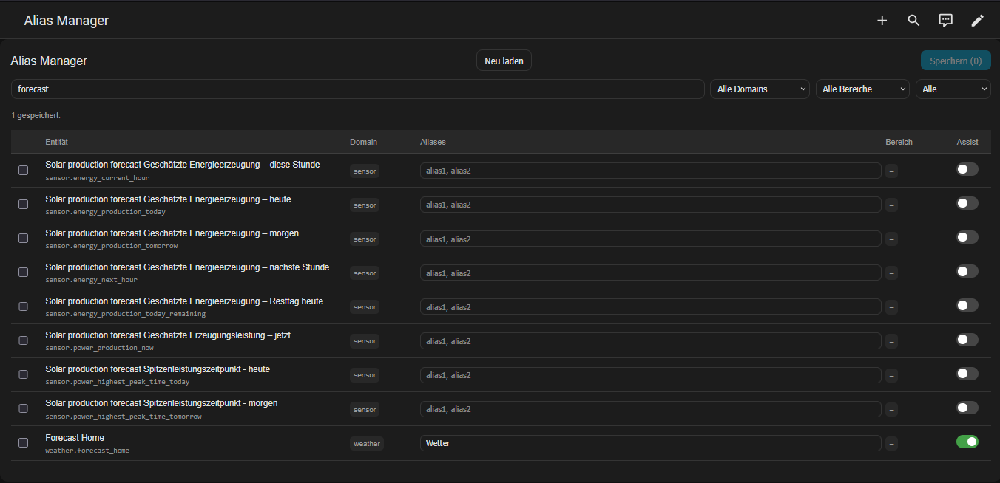

# HA Alias Manager

[](https://github.com/hacs/integration)
[](https://github.com/andreasbloch/ha-alias-manager/releases)
[](LICENSE)

A custom Lovelace card for bulk management of entity aliases and Assist exposure in Home Assistant.



## Features

- 📋 **Bulk alias editing** — edit aliases for all entities in a single table view (comma-separated)
- 🎤 **Assist toggle** — enable or disable entities for voice assistants with a single click
- 🔍 **Filtering** — filter by domain, area, Assist status, or free-text search
- 📄 **Pagination** — 50 entities per page with lazy alias loading for performance
- 💾 **Bulk save** — save all changes at once
- 🔄 **Reload** — refresh entity list without reloading the page

## Why this card?

Home Assistant's default UI requires you to click into each entity individually to add aliases or toggle Assist exposure. With hundreds of entities, this is extremely tedious. This card provides a spreadsheet-like interface to manage everything in one place.

## Installation

### Via HACS (recommended)

1. Open HACS in your Home Assistant instance
2. Click the three-dot menu → **Custom repositories**
3. Add `https://github.com/andreasbloch/ha-alias-manager` as a **Dashboard** type
4. Search for "HA Alias Manager" and install it
5. Hard-refresh your browser (Ctrl+Shift+R)

### Manual

1. Download `ha-alias-manager.js` from the [latest release](https://github.com/andreasbloch/ha-alias-manager/releases)
2. Copy to your Home Assistant `config/www/` directory:
   ```bash
   cp ha-alias-manager.js /config/www/ha-alias-manager.js
   ```
3. Add the resource in **Settings → Dashboards → Resources**:
   ```
   URL: /local/ha-alias-manager.js
   Type: JavaScript Module
   ```
4. Hard-refresh your browser (Ctrl+Shift+R)

## Usage

Add the card to any Lovelace dashboard:

```yaml
type: custom:ha-alias-manager
```

### Recommended setup

For the best experience, create a dedicated dashboard in **Panel Mode**:

1. **Settings → Dashboards → Add Dashboard**
   - Name: `Alias Manager`
   - Icon: `mdi:microphone`
2. Open the new dashboard → **Edit** → three-dot menu → **Enable Panel Mode**
3. Add the card — it fills the full screen

## How aliases work

Aliases are alternative names for entities used by Home Assistant's voice assistants (Assist). When you add an alias, you can use that phrase in voice commands.

**Example aliases for a living room light:**
```
Living Room Light, Lights, Ceiling Light, Room Light
```

## Technical details

The card uses the Home Assistant WebSocket API via `this._hass.callWS()`:

| Operation | WebSocket command |
|---|---|
| Load entity list | `config/entity_registry/list` |
| Load aliases (per page) | `config/entity_registry/get` |
| Save aliases | `config/entity_registry/update` |
| Toggle Assist | `homeassistant/expose_entity` |

Aliases are lazy-loaded per page (50 at a time) and cached to avoid excessive WebSocket calls.

## Compatibility

- Home Assistant 2025.1.0+
- Any modern browser

## Contributing

Pull requests and issues are welcome! Please open an issue before submitting a PR for major changes.

## License

MIT License — see [LICENSE](LICENSE) for details.
